# 一 Maxwell简介

​		Maxwell是一个能实时读取MySQL二进制日志binlog，并生成 JSON 格式的消息，作为生产者发送给 Kafka，Kinesis、RabbitMQ、Redis、Google Cloud Pub/Sub、文件或其它平台的应用程序。它的常见应用场景有ETL、维护缓存、收集表级别的dml指标、增量到搜索引擎、数据分区迁移、切库binlog回滚方案等。工作方式是伪装成一个Slave，接收binlog events，然后根据schemas信息拼装，可以接受ddl、xid、row等各种event.

# 二 快速开始

## 2.1 检查MySQL的相关配置

### 2.1.1 server_id

​		可以通过查看MySQL配置文件my.cnf, 也可以通过MySQL的show命令来查看.

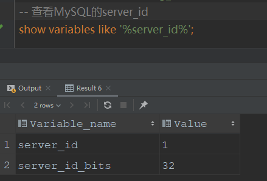

​		这里在idea的数据库工具中通过MySQL命令来查看MySQL的server_id, 可以看到wodeserver_id是1.server_id是建议设置成1, 不是1并不会单个maxwell对MySQL的数据监听.

### 2.1.2 binlog_format

​		参考server_id的查看方式, 可以看到MySQL的binlog_format为Row格式,如下图: 

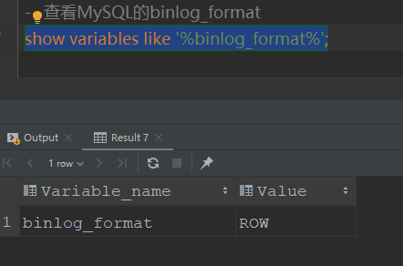

​		Maxwell监听MySQL的一个必要条件就是MySQL的binlog_format为ROW模式, 目前的MySQL安装后默认的binlog_format就是ROW, 所以这里也无需做更改. 如果MySQL的binlog_format不是ROW, 则可以参考本系列第一篇文章中的命令进行设置.

## 2.1 在MySQL中创建有相关权限的账号

​		在MySQL命令行中使用下面的命令可以快速设置一个权限较大的账号

```mysql
-- 创建maxwell用户
CREATE USER 'maxwell_user1'@'%' IDENTIFIED BY 'maxwell_user1';
-- 授予maxwell_user1用户maxwell库的所有操作权限: insert,update,delete,replcation等
GRANT ALL ON maxwell.* TO 'maxwell_user1'@'%';
-- 授予maxwell_user1用户所有库表的查询和备份权限, 
-- 这里的 *.* 表示匹配MySQL中所有的库和表.
-- 在实际的生产工程中, 可能会因为数据库需要泉下管控, 从而使用一些指定的库名,表名进行限定,例如指定Maxwell监听database1: 则可以使用 database1.*,Maxwell后续只有database1这个库的备份权限.
GRANT SELECT, REPLICATION CLIENT, REPLICATION SLAVE ON *.* TO 'maxwell_user1'@'%';
```

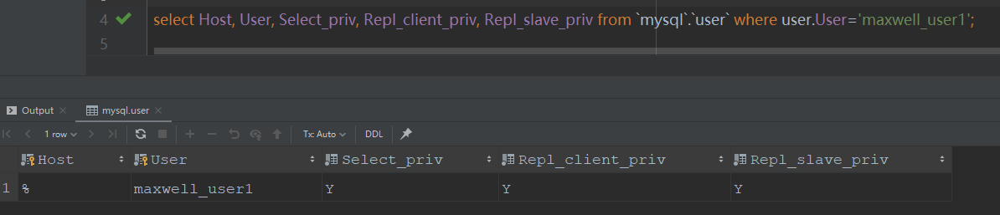

​		执行完成后,可以通过途中的命令查看到, MySQL已经有了maxwell的用户, 并且具备相关的权限.

## 2.2 快速启动

### 2.2.1 使用压缩包启动

​		参考官网上的命令即可:

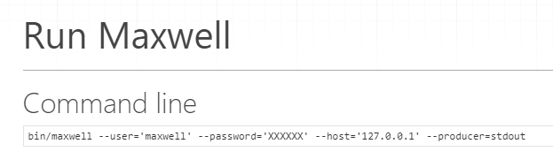

### 2.2.2 使用docker启动

#### 2.2.2.1 拉取镜像

​		使用命令：

```shell
docker pull zendesk/maxwell
```

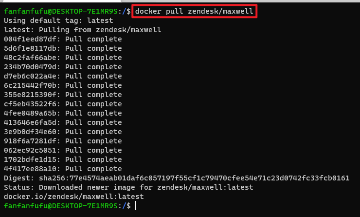

#### 2.2.2.2 使用docker运行

​		使用命令：

```shell
docker run -it zendesk/maxwell bin/maxwell --host='172.17.0.2' --port=3306 --user='maxwell_user1' --password='maxwell_user1' --producer=stdout
```

##### 		命令说明：

​		【-it】：表示该容器内的输出打印到控制台

​		【zendesk/maxwell】：上一步拉取的Maxwell的镜像名

​		【bin/maxwell】：Maxwell服务的启动命令，实际上就是执行Maxwell包中bin目录下的maxwell文件，是一个java工程的启动脚本。

​		【--host='172.17.0.2'】：--host配置的是MySQL的地址，因为我本地的MySQL是以容器的方式启动的，在docker的网络中为其分配了一个IP，就是172.17.0.2

​		【--port=3306】：MySQL的端口，由于MySQL没有使用其他的端口，这里就是默认的3306

​		【--user='maxwell_user1'】：--user就是配置前文中在MySQL中为Maxwell进行CDC而创建的连接MySQL的账号

​		【--password='maxwell_user1'】：连接MySQL的账号的密码

​		【--producer=stdout】：--producer配置了Maxwell的输出方式，这里的stdout表示输出到控制台。在实际工程中，一般是输出到Kafka，redis这样的中间件中，方便后续的使用。

##### 		启动效果

​		当看到 **BinlogConnectorReplicator - Binlog connected.**，就说明Maxwell服务已经启动成功，开始监听MySQL了。

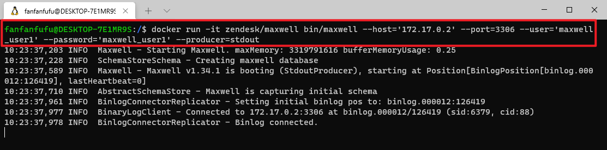

​		并且在首次启动并监听MySQL时, Maxwell会在MySQL中创建一个名为maxwell的库. 这个库的十分重要, Maxwell的运行离不开这个库, 后续会对Maxwell的运行机制详细分析时再说明.

##### 		运行过程的输出

​		试着在数据库中新增，修改，删除一些数据，看看会有什么输出。

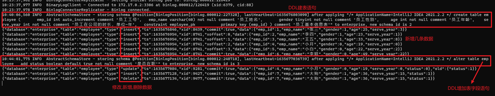

##### 		断点续传体验

​		先停掉maxwell的容器, Maxwell的服务自然也就停掉了.

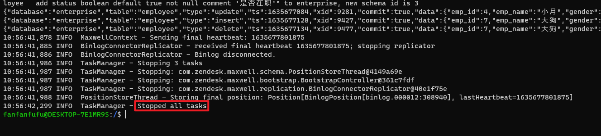

​		然后对数据表进行操作, 再次启动一个Maxwell容器, 可以看到: 在没有Maxwell服务运行的这段事件内所产生的event, 在Maxwell重新运行后会被相继处理, 并显示到控制台中.

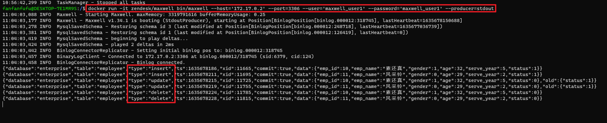

## 2.3 通过配置文件的方式启动

​		由于Maxwell本身是一个java工程, 并且是GitHub上的一个开源项目, 因此我把Maxwell的源码pull到本地, 可以像启动一个普通的spring工程一样在IDEA中启动, 这里就可以通过配置文件来启动maxwell.

### 2.3.1 新增config.properties文件

​		因为Maxwell启动时是默认读取工程根目录下的config.properties文件, 所以新增的配置文件就放在maxwell目录下

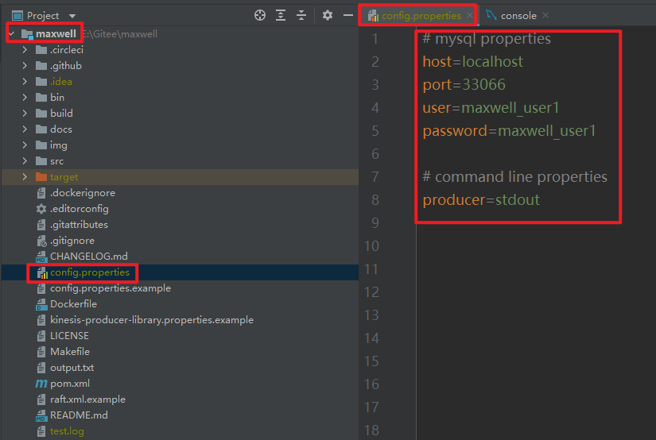

​		config.properties文件也可以放在其他目录, 需要注意的就是如果不是在maxwell工程的根目录下, 在启动工程时要想使用配置文件, 就需要指定配置文件的位置, 否则服务无法启动.

### 2.3.2 启动服务

​		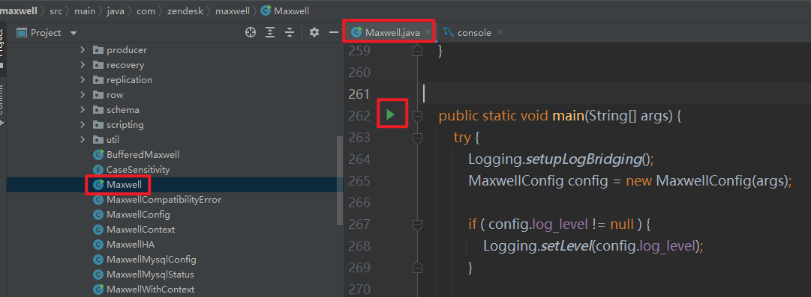

​		找到Maxwell主类启动即可.

#### 2.3.2.1 结果输出到控制台

​		输出结果到控制台中配置十分简单, config.properties文件中配置producer选项为stdout即可.

```properties
producer=stdout
```

​		效果如下:

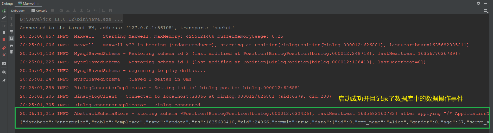

2.3.2.2 结果输出到Kafka

​		将config.properties文件中producer这一配置项改为kafka, 并且在配置上Kafka相关的地址和topic名称即可:

```properties
# Kafka properties
producer=kafka
kafka.bootstrap.servers=localhost:9092
kafka_topic=fq-test-01
```

​		效果如下:

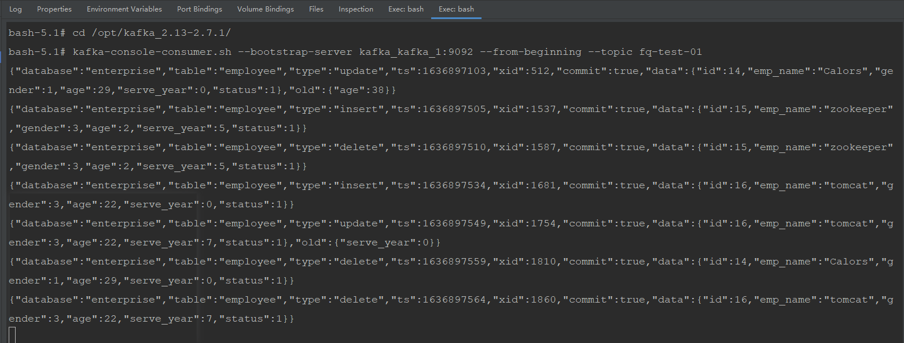

​		通过Kafka的相关命令可以看到打印出了数据中数据变化所产生的一系列事件数据.

# 三 Maxwell数据格式

## 3.1 数据格式说明

​		Maxwell只支持json格式的数据, 从前面的截图中可以看到, Maxwell输出的是每一行数据的信息.包含了完整的内容,以及对应的操作.

### 3.1.1 insert操作

```json
{
    "database": "enterprise",
    "table": "employee",
    "type": "insert",
    "ts": 1635687226,
    "xid": 33936,
    "commit": true,
    "data":
    {
        "id": 12,
        "emp_name": "Tom",
        "gender": 1,
        "age": 53,
        "serve_year": 31,
        "status": 1
    }
}
```

​		新增的一条数据, Maxwell监听产生的事件数据包含了库(database), 表(table), 操作类型(type), 时间(ts--只到秒级精度), 事务id(xid), 事务提交(commit), 数据本身的内容(data-字段及其最新的值)

### 3.1.2 update操作

```
{
	"database":"enterprise",
	"table":"employee",
	"type":"update",
	"ts":1635683410,
	"xid":24366,
	"commit":true,
	"data":
	{
		"id":9,
		"emp_name":"Alice",
		"gender":0,
		"age":37,
		"serve_year":9,
		"status":1
	},
	"old":
	{
		"status":0
	}
}
```

​		修改事件的基本的数据格式与insert的没有太大的区别, 通过type字段的值为update表示这是一个update时间所操作的一条数据的事件的数据, 与insert的事件数据不同的地方在于,多了一个字段old, 其内容是本地update操作修改的数据的字段以及旧的值.

### 3.1.3 delete操作

```
{
    "database": "enterprise",
    "table": "employee",
    "type": "delete",
    "ts": 1635687848,
    "xid": 35505,
    "commit": true,
    "data":
    {
        "id": 12,
        "emp_name": "Tom",
        "gender": 1,
        "age": 53,
        "serve_year": 31,
        "status": 1
    }
}
```

​		数据格式与insert并无区别, 只通过type字段的值为delete来表示是一个delete事件的数据.

### 3.1.4 一次操作多条数据

​		MySQL一次操作多条数据(一次insert/update/delete多条数据)是, Maxwell就会产生相同数量的json事件数据, 其中他们的xid都相同.

# 四 总结

​		本文介绍了Maxwell的基本原理, 以及快速开始,和Maxwell相关配置的内容.对Maxwell有了初步的认识

