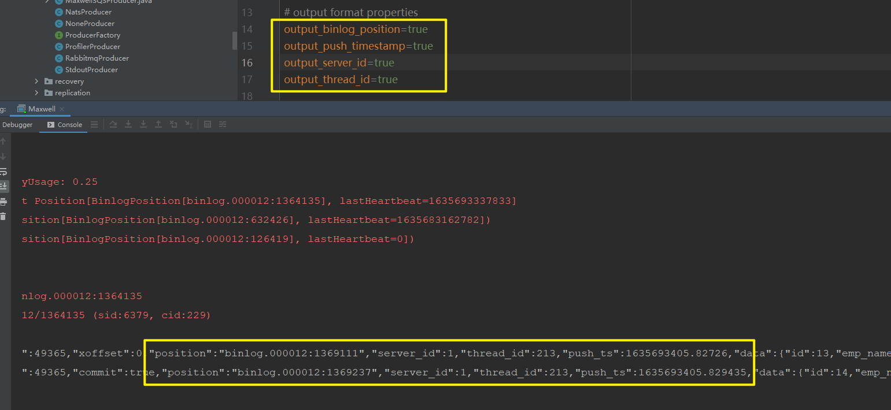
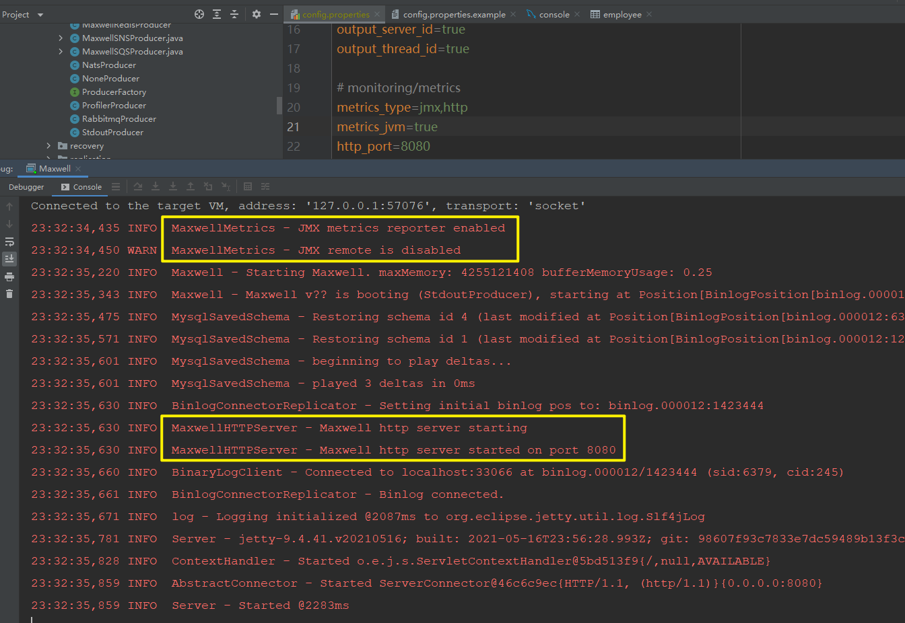
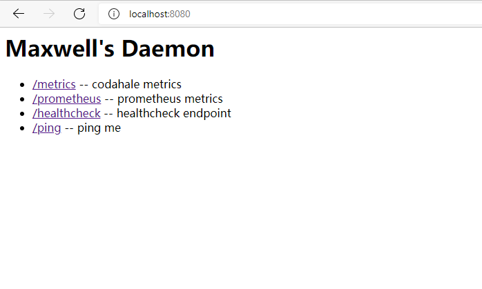

## 一 相关配置项的说明

​		这里对Maxwell的一些配置项进行相关的说明

### 1.1 服务相关配置项

| 配置项名称    | 配置项值类型 | 可否通过配置文件配置 | 默认值                                     | 说明                                      |
| :------------ | :----------- | :------------------- | :----------------------------------------- | :---------------------------------------- |
| config        | string       | 否                   | $PWD/config.properties                     | 指定Maxwell启动时需要读取的配置文件的路径 |
| log_level     | string       | 可                   | info                                       | 日志等级                                  |
| daemon        | /            | 否                   | /                                          | 将Maxwell作为后台守护进程运行             |
| init_position | string       | 否                   | 无, 格式: BINLOG_FILE:POSITION[:HEARTBEAT] | maxwell启动时指定开始读取的binlog位置     |

### 1.2 MySQL相关配置项

| 配置项名称        | 配置项值类型 | 可否通过配置文件配置 | 默认值    | 说明                               |
| ----------------- | ------------ | -------------------- | --------- | ---------------------------------- |
| host              | string       | 可                   | localhost | maxwell监听的MySQL的host           |
| port              | int          | 可                   | 3306      | maxwell监听的MySQL的port           |
| user              | string       | 可                   | /         | maxwell监听的MySQL所用的账号       |
| password          | string       | 可                   | /         | maxwell监听的MySQL所用的账号的密码 |
| client_id         | string       | 可                   | maxwell   | maxwell实例的唯一文本标识符        |
| replica_server_id | long         | 可                   | 6379      | maxwell实例唯一数字标识符          |
| gtid_mode         | boolean      | 可                   | false     | 是否开启基于全局事务备份的模式     |

​		其中, 当想要通过不同的Maxwell实例监听同一个MySQL时, client_id和replica_server_id是共同作用生效的, 任何一个配置不对都会导致无法启动多个maxwell实例监听同一个MySQL.

​		如果需要启用gtid_mode,除了在Maxwell的配置中配置为true, 先决条件还需呀MySQL是开启了基于全局事务模式的,这样才能启动基于全局事务备份的Maxwell实例.

### 1.3 producer相关配置项

| 配置项名称                     | 配置项值类型 | 可否通过配置文件配置 | 默认值                                                  | 说明                                                         |
| ------------------------------ | ------------ | -------------------- | ------------------------------------------------------- | ------------------------------------------------------------ |
| producer                       | string       | 可                   | stdout/file/kafka/kinesis/pubsub/sqs/rabbitmq/redis     | Maxwell产生的消息的下游消费对象                              |
| producer_ack_timeout           | log          | 可                   |                                                         | 配置消息传输失败的超时事件,单位为毫秒                        |
| producer_partition_by          | string       | 可                   | database/table/primary_key/transaction_id/column/random | 分区机制, 可用于防止数据倾斜                                 |
| producer_partition_columns     | string       | 可                   |                                                         | 如果producer_partition_by的值是column, 则该配置项配置的内容就是用于分区的字段名,用','做分隔符 |
| producer_partition_by_fallback | string       | 可                   | database/table/primary_key/transaction_id               | 当producer_partition_by=column时必须配置该配置项,作为column有缺失时的补充 |
| ignore_producer_error          | boolean      | 可                   | true                                                    | 是否忽略发送消息的错误,默认为true,即发生错误时只记录相关的错误日志; 否则发生错误时Maxwell服务就会停止. |

### 1.4 过滤规则配置-filter

​		过滤规则只通过一个配置项-filter来配置, 官方的文档里只提到了两种类型: exclude和include.但是通过查看源码发现还有第三种类型:blacklist

​		示例:

```properties
filter= exclude: *.*, include: foo.*, include: bar.baz, include: foo.bar.col_eg = "value_to_match"
```

​		其中:

​		[exclude]配置的内容表示排除所有的库与表

​		[include]配置的内容分别表示:

​			(1) 当foo库中任何表的数据发生变化时, Maxwell产生相关的事件消息

​			(2) 当bar库的baz表中的数据发生变化时, Maxwell产生相关的事件消息

​			(3) 当foo库的bar表的col_eg字段的值被修改为value_to_match时,Maxwell才会产生相关的事件消息

​		[blacklist]配置的内容则表示,无论对应的库中的数据发生任何变化Maxwell都不会产生任何消息.

​		exclude与blacklist的区别在于,blacklist的过滤更强. exclude中配置的库表仍然还是要构建其事件数据, 但是blacklist中配置的库表,Maxwell是不会为其构建事件数据的.

​		在Maxwell的工作过程中, 如果读取到的binlog日志所产生的修改不是maxwell库中所记录的库表字段的修改内容, 那么就会产生相关的报错, 从而导致Maxwell无法继续正常工作. exclude的配置内容,无法完全规避这种错误, 而blacklist所配置的库与表, 就可以在Maxwell遇到maxwell库中没有记录的库/表/字段的信息的时候, 对其进行过滤, 从而保证Maxwell可以正常工作.

### 1.5 输出数据格式相关配置项

​		这部分配置项很多,无法一一列举并说明,只介绍部分.其余的可以到官网[Reference - Maxwell's Daemon (maxwells-daemon.io)](http://maxwells-daemon.io/config/#formatting)上看

| 配置项名称             | 配置项值类型 | 可否通过配置文件配置 | 默认值 | 说明                                         |
| ---------------------- | ------------ | -------------------- | ------ | -------------------------------------------- |
| output_binlog_position | boolean      | 可                   | false  | 输出数据变化事件在binlog文件中日志记录的位置 |
| output_push_timestamp  | boolean      | 可                   | false  | 输出数据变化事件消息发送给下游的高精度时间   |
| output_server_id       | boolean      | 可                   | false  | 输出数据执行变化事件的MySQL的server_id       |
| output_thread_id       | boolean      | 可                   | false  | 输出数据MySQL执行变化事件的线程id            |
| output_ddl             | boolean      | 可                   | false  | 输出ddl语句                                  |



​		从上图中可以看到,在配置文件中配置了相关的输出为true之后, Maxwell所产生的事件消息数据中,多了相关字段的内容, 可以看到两条数据在binlog中日志记录的位置,以及push给下游的精确时间. 相较而言, binlog_position更能区别两条数据的唯一性.

### 1.6 monitoring / metrics(监控/度量相关配置项)

​		该部分的配置项也十分多,这里只介绍部分,更多配置项可前往官网查阅

| 配置项名称      | 配置项值类型 | 可否通过配置文件配置 | 默认值                   | 说明                                                         |
| --------------- | ------------ | -------------------- | ------------------------ | ------------------------------------------------------------ |
| metrics_type    | string       | 可                   | [slf4j/jmx/http/datadog] | Maxwell的度量类型,可以配置多个,用','进行分隔即可             |
| metrics_jvm     | boolean      | 可                   | false                    | 是否监控/度量Maxwell服务的jvm信息,包含memory usage, GC stats等 |
| http_diagnostic | boolean      | 可                   | false                    | 是否开启http诊断                                             |
| http_port       | int          | 可                   | 8080                     | 当metrics_type中http诊断的请求Maxwell服务运行状态信息的端口  |

​		当配置文件中配置了监控相关的选项后



​		在浏览器中访问8080端口,就可以看到Maxwell运行的相关服务监控的信息了,如果再对接上相关的工具,就可以实现对Maxwell服务的可视化监控和告警了.其实Maxwell就相当于一个Spring应用,因此很多对spring应用的监控手段也是可以用在Maxwell身上的.

