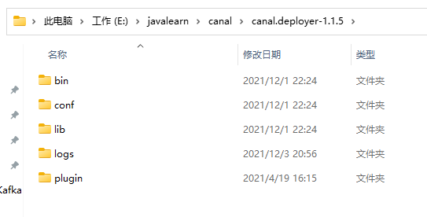

# 1 创建canal相关账号

```mysql
-- 创建canal账号
create user 'canal_user'@'%' identified by 'canal_user';
grant SELECT, REPLICATION SLAVE, REPLICATION CLIENT on *.* to 'canal_user'@'%';
flush privileges;
```

# 2 下载canal.deployer

## 2.1 下载canal.deployer的压缩包到本地, 

​		我下载的1.1.5版本的,地址为https://github.com/alibaba/canal/releases/download/canal-1.1.5/canal.deployer-1.1.5.tar.gz

## 2.2 解压压缩包

​		解压压缩包,得到下图中的目录结构



# 3 修改配置

​		修改 conf -> example -> instance.properties 文件中的相关配置项


​		具体修改的部分配置项内容如下:

```properties
# 需要连接的MySQL的相关配置
# 1.MySQL的IP和地址
canal.instance.master.address=127.0.0.1:33066
# 2.canal启动后需要开始监听的binlog的文件名
canal.instance.master.journal.name=binlog.000014
# 3.canal启动后从指定binlog的指定开始监听的position位置
canal.instance.master.position=156

# 当前instance连接MySQL所用的账号密码
canal.instance.dbUsername=canal_user
canal.instance.dbPassword=canal_user
```

​		其中,binlog文件名和position可以在MySQL命令行界面中执行 **show master status**命令, 查看到MySQL最新的binlog文件名和所处的最新的position.

# 4 windows中启动canal服务端

## 4.1 运行步骤

​		在window中, 在canal解压文件夹中的bin目录下, 双击startup.bat, 即可运行canal服务端.


​			成功启动显示结果:


## 4.2 踩坑记录

### 4.2.1 程序无法启动, 在启动时报错:


​		报错显示无法识别 VM Option 'PermSize=128m', 该参数时配置永久代的区域大小, 该报错的原因在于, 我windows中使用的JDK时11版本的, JDK在9之后默认使用的GC时G1, 而G1时不存在永久代这个分区的, 因此无法识别这个参数, 故而程序无法启动.

​		解决措施也比较简单, 修改startup.bat文件, 去掉**PermSize=128m**这一启动参数即可.


### 4.2.2 程序启动成功,但是有运行时报错


​		该报错十分不容易发现, 是在后续写了一个简单的客户端用户接受消息并打印时,发现数据库已经做了修改,但客户端并没有受到消息, 检查example.log中的日志时发现的.

​		该报错显示的是连接数据库失败, 于是在canal的GitHub中去寻找产生原因与解决办法. 最终发现:

​		**原因**: 我在Windows中使用的MySQL版本是8.0.25版本的, 而MySQL8.0.X版本的密码保存机制与以前5.X版本的不一样, 从而使得canal程序启动后一直无法连接到MySQL.

​		**解决办法**: 可以考虑更换到5.X的版本, 或者在MySQL命令行中通过下面的命令修改, canal_user的鉴权方式

```mysql
ALTER USER 'canal_user'@'%' IDENTIFIED WITH mysql_native_password BY 'canal_user';
ALTER USER 'canal_user'@'%' IDENTIFIED BY 'canal_user' PASSWORD EXPIRE NEVER;
FLUSH PRIVILEGES;
```

​		效果: 程序启动成功后, 日志文件中记录的日志内容如下:


​		这样的日志说明,canal服务端已经成功启动并正常运行了.

# 5 编写简单的服务端

## 5.1 创建一个简单的SpringBoot工程

​		在pom.xml中引入相关依赖:

```xml
<dependency>
    <groupId>com.alibaba.otter</groupId>
    <artifactId>canal.client</artifactId>
    <version>1.1.5</version>
</dependency>
<dependency>
    <groupId>com.alibaba.otter</groupId>
    <artifactId>canal.protocol</artifactId>
    <version>1.1.5</version>
</dependency>
```

## 5.2 编写一个自定义的CanalClient

​		无需编写任何配置, 直接创建一个CanalClient


```java
package com.example.canaldemo.deploy;

import com.alibaba.otter.canal.client.CanalConnector;
import com.alibaba.otter.canal.client.CanalConnectors;
import com.alibaba.otter.canal.protocol.CanalEntry;
import com.alibaba.otter.canal.protocol.Message;
import org.springframework.beans.factory.InitializingBean;
import org.springframework.stereotype.Component;

import java.net.InetSocketAddress;
import java.util.List;

/**
 * @author FuQi
 * @date 2021/12/3 21:34
 * @description
 */
@Component
public class CanalClient implements InitializingBean {

    private final static int BATCH_SIZE = 1000;

    @Override
    public void afterPropertiesSet() throws Exception {
        // 创建链接
        CanalConnector connector = CanalConnectors.newSingleConnector(new InetSocketAddress("127.0.0.1", 11111),
                "example", "", "");
        try {
            //打开连接
            connector.connect();
            //订阅数据库表,全部表
            connector.subscribe(".*\\..*");
            //回滚到未进行ack的地方，下次fetch的时候，可以从最后一个没有ack的地方开始拿
            connector.rollback();
            while (true) {
                // 获取指定数量的数据
                Message message = connector.getWithoutAck(BATCH_SIZE);

                //获取批量ID
                long batchId = message.getId();
                //获取批量的数量
                int size = message.getEntries().size();
                //如果没有数据
                if (batchId == -1 || size == 0) {
                    try {
                        //线程休眠2秒
                        Thread.sleep(2000);
                    } catch (InterruptedException e) {
                        e.printStackTrace();
                    }
                } else {
                    //如果有数据,处理数据
                    printEntry(message.getEntries());
                }
                //进行 batch id 的确认。确认之后，小于等于此 batchId 的 Message 都会被确认。
                connector.ack(batchId);
            }
        } catch (Exception e) {
            e.printStackTrace();
        } finally {
            connector.disconnect();
        }
    }

    /**
     * 打印canal server解析binlog获得的实体类信息
     */
    private static void printEntry(List<CanalEntry.Entry> entrys) {
        for (CanalEntry.Entry entry : entrys) {
            if (entry.getEntryType() == CanalEntry.EntryType.TRANSACTIONBEGIN || entry.getEntryType() == CanalEntry.EntryType.TRANSACTIONEND) {
                //开启/关闭事务的实体类型，跳过
                continue;
            }
            //RowChange对象，包含了一行数据变化的所有特征
            //比如isDdl 是否是ddl变更操作 sql 具体的ddl sql beforeColumns afterColumns 变更前后的数据字段等等
            CanalEntry.RowChange rowChage;
            try {
                rowChage = CanalEntry.RowChange.parseFrom(entry.getStoreValue());
            } catch (Exception e) {
                throw new RuntimeException("ERROR ## parser of eromanga-event has an error , data:" + entry.toString(), e);
            }
            //获取操作类型：insert/update/delete类型
            CanalEntry.EventType eventType = rowChage.getEventType();
            //打印Header信息
            System.out.println(String.format("================》; binlog[%s:%s] , name[%s,%s] , eventType : %s",
                    entry.getHeader().getLogfileName(), entry.getHeader().getLogfileOffset(),
                    entry.getHeader().getSchemaName(), entry.getHeader().getTableName(),
                    eventType));
            //判断是否是DDL语句
            if (rowChage.getIsDdl()) {
                System.out.println("================》;isDdl: true,sql:" + rowChage.getSql());
            }
            //获取RowChange对象里的每一行数据，打印出来
            for (CanalEntry.RowData rowData : rowChage.getRowDatasList()) {
                //如果是删除语句
                if (eventType == CanalEntry.EventType.DELETE) {
                    printColumn(rowData.getBeforeColumnsList());
                    //如果是新增语句
                } else if (eventType == CanalEntry.EventType.INSERT) {
                    printColumn(rowData.getAfterColumnsList());
                    //如果是更新的语句
                } else {
                    //变更前的数据
                    System.out.println("------->; before");
                    printColumn(rowData.getBeforeColumnsList());
                    //变更后的数据
                    System.out.println("------->; after");
                    printColumn(rowData.getAfterColumnsList());
                }
            }
        }
    }

    private static void printColumn(List<CanalEntry.Column> columns) {
        for (CanalEntry.Column column : columns) {
            System.out.println(column.getName() + " : " + column.getValue() + "    update=" + column.getUpdated());
        }
    }
}
```

## 5.3 启动自定义客户端服务

​		找到application主类,启动即可运行自定义的canal客户端.


## 5.4 测试效果

​		连接MySQL, 并创建一个good表, 然后往其中写入和修改数据,就可以看到控制台中打印出的相关数据了


​		数据的新增与修改:


# 6 参考文档

[超详细的Canal入门，看这篇就够了！](https://blog.csdn.net/yehongzhi1994/article/details/107880162)

[Canal详细入门实战(使用总结)](https://www.1024sky.cn/blog/article/52984)

